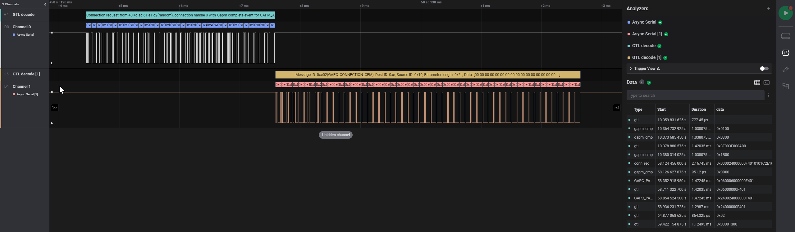

  # GTL interface decoder
  

## Installation

Open the extensions tab in Saleae logic 2, 'GTL interface decoder' should be in the list. If it isn't you can click the three dots and check for updates. 

You can also clone this repo, click the three dots under extentions, click 'Load existing extention' and select the json file from this repo in the window that pops up. 

## Usage

This analyzer can be added like any other analyzer, it only has one input. That should be set to the UART that communicates the GTL commands. As GTL usually has bidirectional communication another analyzer can be added for the second UART line.

  